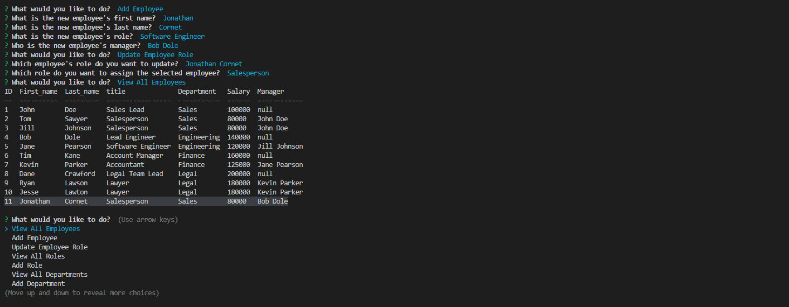
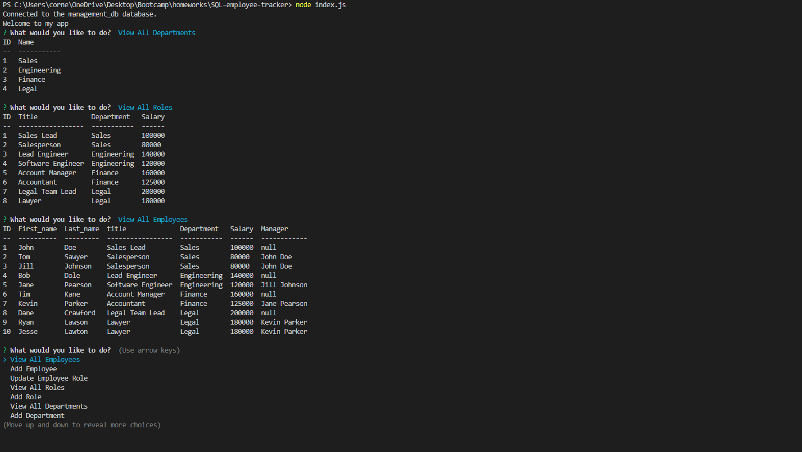

# SQL Employee Tracker


## User Story

```md
AS A business owner
I WANT to be able to view and manage the departments, roles, and employees in my company
SO THAT I can organize and plan my business
```

## Description

This command-line application allows the user to view and manage their departments, roles, and employees utilizing a SQL database. The following Acceptance Criteria is met:

```md
GIVEN a command-line application that accepts user input
WHEN I start the application
THEN I am presented with the following options: view all departments, view all roles, view all employees, add a department, add a role, add an employee, and update an employee role
WHEN I choose to view all departments
THEN I am presented with a formatted table showing department names and department ids
WHEN I choose to view all roles
THEN I am presented with the job title, role id, the department that role belongs to, and the salary for that role
WHEN I choose to view all employees
THEN I am presented with a formatted table showing employee data, including employee ids, first names, last names, job titles, departments, salaries, and managers that the employees report to
WHEN I choose to add a department
THEN I am prompted to enter the name of the department and that department is added to the database
WHEN I choose to add a role
THEN I am prompted to enter the name, salary, and department for the role and that role is added to the database
WHEN I choose to add an employee
THEN I am prompted to enter the employee’s first name, last name, role, and manager, and that employee is added to the database
WHEN I choose to update an employee role
THEN I am prompted to select an employee to update and their new role and this information is updated in the database 
```

The application prompt looks as follows:



The generated tables looks as follows:



The following link leads to a demonstration of the application being used:

Video of usage:

https://watch.screencastify.com/v/xAKXtOECugF2d5fcRxXn

## Table of Contents

- [Installation](#installation)
- [Usage](#usage)
- [Credits](#credits)
- [Contribute](#contribute)
- [Tests](#tests)
- [Questions](#questions)
- [License](#license)

## Installation

The following packages need to be installed in order to run the application:

Inquirer: https://www.npmjs.com/package/inquirer/v/8.2.4

Node MySQL 2: https://www.npmjs.com/package/mysql2

Console.Table: https://www.npmjs.com/package/console.table

These packages can be installed using the command:

```md
npm i
```

## Usage

This program can be downloaded and used by anyone. To run the application, use the following node command:

```md
node index.js
```

## Credits

This following packages are credited with helping create this application:

Inquirer is used for asking the user questions: https://www.npmjs.com/package/inquirer/v/8.2.4

Node MySQL 2 is used for connecting with and querying the database: https://www.npmjs.com/package/mysql2

Console.Table is used for formatting the data on the CLI: https://www.npmjs.com/package/console.table

## Contribute

This is a completed application and does not need any contributions.

## Tests

There is no testing for this application.

## Questions

Feel free to reach out to me with questions:

Find my GitHub at: [GitHub Profile](https://github.com/cornetj13)

Email me at: cornetj2@gmail.com

## License

This source code is licensed under the MIT license found in the LICENSE file in the root directory of this source tree.
